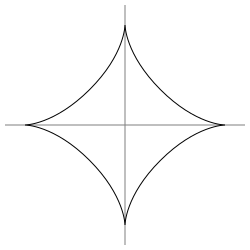

Below is an astroid as an SVG image:

On both Gogs and Gitea, the alt text is displayed instead of the image.
Additionally, clicking on the alt text doesn't display the image either,
the SVG source code is shown instead:

* [test on try.gogs.io](https://try.gogs.io/edgar/test-svg-mime)
* [test on try.gitea.io](https://try.gitea.io/edgar/test-svg-mine)

The issue has been reported:

* Gogs #4553: [SVG images are served with wrong MIME type](https://github.com/gogits/gogs/issues/4553)
* Gitea #1095: [Gitea can't render SVG files.](https://github.com/go-gitea/gitea/issues/1095)
