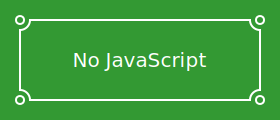

Below are two SVG images. The first one has embedded JavaScript:

On both Gogs and Gitea, the alt text is displayed instead of the images.
Additionally, clicking on the alt text doesn't display the images
either: the SVG source code is shown instead.

Tests:

* [on github.com](https://github.com/edgar-bonet/test-svg-mime)
* [on try.gogs.io](https://try.gogs.io/edgar/test-svg-mime)
* [on try.gitea.io](https://try.gitea.io/edgar/test-svg-mine)

The issue has been reported:

* Gogs #4553: [SVG images are served with wrong MIME type](https://github.com/gogits/gogs/issues/4553)
* Gitea #1095: [Gitea can't render SVG files.](https://github.com/go-gitea/gitea/issues/1095)
